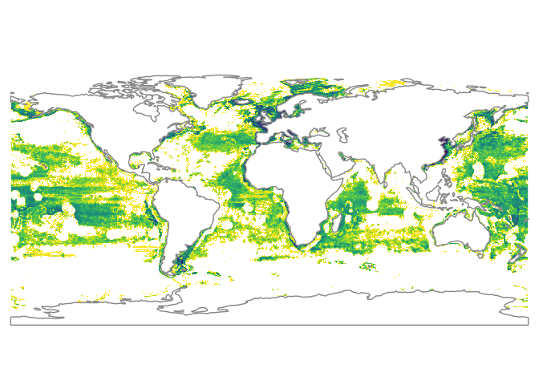
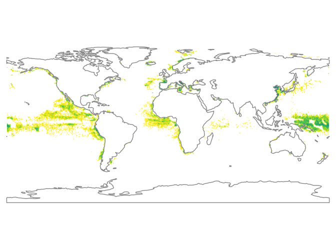
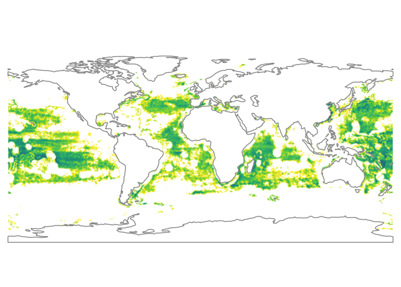
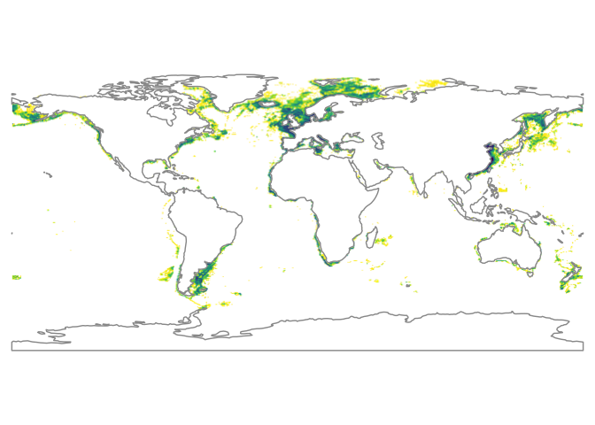

Tracking the Global Footprint of Fisheries: Figure 1
================

Code for making Figure 1 from Tracking the Footprint of Global Fisheries paper from public Big Query datasets provided by Global Fishing Watch.

##### Figure prep

``` r
theme_gfw_paper <-  theme(text = element_text(family="Arial", face="bold", size=12),
        axis.text.x = element_text(size = 12, colour = "black"),
        axis.text.y = element_text(size = 12, colour = "black"),
        axis.line.x = element_line(colour = "black", size = .5),
        axis.line.y = element_line(colour = "black", size = .5),
        legend.position = "bottom",
        axis.title.y = element_text(size = 12, margin=margin(0,15,0,0)),
        axis.title.x = element_text(size = 12, margin=margin(15,0,0,0)),
        panel.grid.major = element_blank(), 
        panel.grid.minor = element_blank(),
        panel.background = element_blank(), 
        axis.line = element_line(colour = "black"),
        plot.margin = unit(c(1,1,1,1), "cm")
        )
```

Load shapefile downloaded from Natural Earth (110m resolution)

``` r
land_df <- read_sf('../data/ne_110m_land/ne_110m_land.shp', quiet = TRUE)
# This shapefile is available from http://www.naturalearthdata.com/downloads/110m-physical-vectors/110m-land/
```

#### SQL query for Total Fishing Effort (0.5 degree)

``` sql
SELECT
  SUM(fishing_hours)/(COS(RADIANS(lat_bin/2)) * POW(111, 2)) hours_sq_km,
  lat_bin,
  lon_bin
FROM (
  SELECT
    FLOOR((lat_bin/100)/0.5) * 0.5 lat_bin,
    FLOOR((lon_bin/100)/0.5) * 0.5 lon_bin,
    fishing_hours
  FROM
    [global-fishing-watch:global_footprint_of_fisheries.fishing_effort]
  WHERE
    _PARTITIONTIME >= "2016-01-01 00:00:00"
    AND _PARTITIONTIME < "2017-01-01 00:00:00"
    AND fishing_hours > 0)
GROUP BY
  lat_bin,
  lon_bin
```

#### SQL Query for Fishing Effort by Geartype (0.5 degree)

``` sql
SELECT
  SUM(fishing_hours)/(COS(RADIANS(lat_bin/2)) * POW(111, 2)) hours_sq_km,
  lat_bin,
  lon_bin,
  geartype
FROM (
  SELECT
    FLOOR((lat_bin/100)/0.5) * 0.5 lat_bin,
    FLOOR((lon_bin/100)/0.5) * 0.5 lon_bin,
    fishing_hours,
    geartype
  FROM
    [global-fishing-watch:global_footprint_of_fisheries.fishing_effort]
  WHERE
    _PARTITIONTIME >= "2016-01-01 00:00:00"
    AND _PARTITIONTIME < "2017-01-01 00:00:00"
    AND fishing_hours > 0)
GROUP BY
  lat_bin,
  lon_bin,
  geartype
```

``` r
head(total_fishing_effort_05)
```

    FALSE   hours_sq_km lat_bin lon_bin
    FALSE 1 0.006005120   -13.0    12.5
    FALSE 2 0.006339496   -42.0   -59.5
    FALSE 3 0.109134825   -41.5   -62.0
    FALSE 4 0.462021867    43.5   -50.0
    FALSE 5 0.034238645    49.0  -124.0
    FALSE 6 0.265192376    49.5  -125.0

``` r
head(fishing_effort_by_type_05)
```

    FALSE   hours_sq_km lat_bin lon_bin geartype
    FALSE 1  0.59905824   -10.5    12.5 trawlers
    FALSE 2  0.21807976    48.5    -3.0 trawlers
    FALSE 3  0.18707084    48.5   -10.5 trawlers
    FALSE 4  0.52536166    61.5    -5.5 trawlers
    FALSE 5  0.07882448    69.5   -59.5 trawlers
    FALSE 6  0.07506287    69.5    42.0 trawlers

#### Process data

Data processing for plotting total fishing effort

``` r
total_fishing_effort_05$hours_sq_km = total_fishing_effort_05$hours_sq_km * 10000
total_fishing_effort_05$logHours = log10(total_fishing_effort_05$hours_sq_km)
total_fishing_effort_05$logHours = ifelse(total_fishing_effort_05$logHours >= 5, 
                                          5, 
                                          total_fishing_effort_05$logHours)
total_fishing_effort_05$logHours = ifelse(total_fishing_effort_05$logHours <= 1, 
                                          1, 
                                          total_fishing_effort_05$logHours)

total_fishing_effort_05 = total_fishing_effort_05 %>%
    filter(lat_bin < 85 & lat_bin > -85 & lon_bin > -180 & lon_bin < 180)
```

Data processing for plotting fishing effort by geartype

``` r
fishing_effort_by_type_05$hours_sq_km = fishing_effort_by_type_05$hours_sq_km * 10000
fishing_effort_by_type_05$logHours = log10(fishing_effort_by_type_05$hours_sq_km)
fishing_effort_by_type_05$logHours = ifelse(fishing_effort_by_type_05$logHours >= 5, 
                                            5, 
                                            fishing_effort_by_type_05$logHours)
fishing_effort_by_type_05$logHours = ifelse(fishing_effort_by_type_05$logHours <= 1, 
                                            1, 
                                            fishing_effort_by_type_05$logHours)

purse_seine_effort_05 = fishing_effort_by_type_05 %>% 
    filter(geartype == 'purse_seines'& 
               lat_bin > -90 & 
               lat_bin < 90 & 
               lon_bin > -180 & 
               lon_bin < 180)


longline_effort_05 = fishing_effort_by_type_05 %>%
    filter(geartype == 'drifting_longlines'& 
               lat_bin > -90 & 
               lat_bin < 85 & 
               lon_bin > -180 & 
               lon_bin < 180)

trawler_effort_05 = fishing_effort_by_type_05 %>%
    filter(geartype == 'trawlers' & 
               lat_bin > -90 & 
               lat_bin < 90 & 
               lon_bin > -180 & 
               lon_bin < 180) 
```


#### Generating Fishing Effort Figure Panels

``` r
cont_fill = 'white'#'grey30' #'grey80'
back_fill =  'white'#'#202A50' #'black' #'#1F2A4F'
cont_color = 'grey60'#'grey30'
#color_grad = c( "#414487", "#2A788E", "#22A884", "#7AD151","#FDE725","#FFC04C")
color_grad = c("#C6DBEF", "#9ECAE1", "#6BAED6","#4292C6" ,"#2171B5", "#084594") #blues
```

##### Total Effort

``` r
total_effort_05 <- ggplot() +
    geom_raster(data = total_fishing_effort_05, 
                aes(x = lon_bin, y = lat_bin, fill = logHours), 
                interpolate = FALSE) +
    geom_sf(data = land_df, 
                 color = cont_color,
                 size = 0.5,
                 fill = cont_fill) +
    scale_fill_viridis("Vessel Density", na.value = NA, limits = c(1, 5), 
                       breaks=c(seq(1,5,length.out = 4)),
                       labels = c('1','10', '100','> 1000' ), 
                       direction = -1)+
    coord_sf(datum = NA) +
    theme_gfw_paper +
    theme(axis.title.x = element_blank(),
          axis.title.y = element_blank(),
          axis.text.x = element_blank(),
          axis.text.y = element_blank(),
          axis.ticks = element_blank(),
          axis.line = element_blank(),
          panel.background = element_rect(color = NA,fill = back_fill),
          legend.position = 'none',
          legend.direction="horizontal",
          plot.margin=unit(c(0,-0.5,-0.5,-0.5), 'cm'),
          legend.text = element_text(size = 6, family = 'Times New Roman'),
          legend.title = element_text(size = 7, family = 'Times New Roman'))
total_effort_05
```



##### Purse Seine Effort

``` r
purse_seine_05 <- ggplot() +
    geom_raster(data = purse_seine_effort_05, 
                aes(x = lon_bin, y = lat_bin, fill = logHours), 
                interpolate = TRUE) +
    geom_sf(data = land_df, 
                 color = cont_color,
                 size = 0.5,
                 fill = cont_fill) +
   scale_fill_viridis("Vessel Density", na.value = NA, limits = c(1, 5), 
                       breaks=c(seq(1,5,length.out = 4)),
                       labels = c('1','10', '100','> 1000' ), 
                       direction = -1) +
    coord_sf(datum = NA) +
    theme_gfw_paper +
    theme(axis.title.x = element_blank(),
          axis.title.y = element_blank(),
          axis.text.x = element_blank(),
          axis.text.y = element_blank(),
          axis.ticks = element_blank(),
          axis.line = element_blank(),
          panel.border = element_blank(),
          panel.background = element_rect(color = NA,fill = back_fill),
          legend.position = 'none',
          plot.margin=unit(c(0,-0.5,-0.5,-0.5), 'cm'))
purse_seine_05
```



##### Drifting Longline Effort

``` r
longline_05 <- ggplot() +
    geom_raster(data = longline_effort_05, 
                aes(x = lon_bin, y = lat_bin, fill = logHours), 
                interpolate = TRUE) +
    geom_sf(data = land_df,
                 color = cont_color,
                 size = 0.5,
                 fill = cont_fill) +
    scale_fill_viridis("Vessel Density", na.value = NA, limits = c(1, 5), 
                       breaks=c(seq(1,5,length.out = 4)),
                       labels = c('1','10', '100','> 1000' ), 
                       direction = -1) +
    coord_sf(datum = NA) +
    theme_gfw_paper +
    theme(axis.title.x = element_blank(),
          axis.title.y = element_blank(),
          axis.text.x = element_blank(),
          axis.text.y = element_blank(),
          axis.ticks = element_blank(),
          axis.line = element_blank(),
          panel.background = element_rect(color = NA,fill = back_fill),
          legend.position = 'none',
          plot.margin=unit(c(0,-0.5,-0.5,-0.5), "cm"))
longline_05
```



##### Trawler Effort

``` r
trawling_05 <- ggplot() +
    geom_raster(data = trawler_effort_05, 
                aes(x = lon_bin, y = lat_bin, fill = logHours), 
                interpolate = TRUE) +
    geom_sf(data = land_df, 
                 color = cont_color,
                 size = 0.5,
                 fill = cont_fill) +
    scale_fill_viridis("Vessel Density", na.value = NA, limits = c(1, 5), 
                       breaks=c(seq(1,5,length.out = 4)),
                       labels = c('1','10', '100','> 1000' ), 
                       direction = -1) +
    coord_sf(datum = NA) +
    theme_gfw_paper +
    theme(axis.title.x = element_blank(),
          axis.title.y = element_blank(),
          axis.text.x = element_blank(),
          axis.text.y = element_blank(),
          axis.ticks = element_blank(),
          axis.line = element_blank(),
          panel.background = element_rect(color = NA,fill = back_fill),
          legend.position = 'none',
          plot.margin=unit(c(-0.5,-0.5,-0.5,-0.5), "cm"))
trawling_05
```




#### Generating Legends

Code for generating legend to a a set of gridded fishing plots. Requires making a plot with a legend and then extracting the legend using get\_legend First for the fishing effort and the for the NPP

``` r
library(cowplot)
#plot with legend
#color_grad = c( "#414487", "#2A788E", "#22A884", "#7AD151","#FDE725","#FFC04C")

legend_plot_05 = ggplot() +
    geom_raster(data = total_fishing_effort_05, 
                aes(x = lon_bin, y = lat_bin, fill = logHours), 
                interpolate = FALSE) +
    geom_polygon(data = land_df,
                 fill = cont_fill) +
    scale_fill_viridis("Vessel Density", 
                       na.value = NA, 
                       limits = c(1, 5),
                       breaks=c(seq(1,5,length.out = 5)),
                       direction = -1) +
    guides(fill = guide_colorbar(barwidth = 12, 
                                 barheight = 0.3, 
                                 title.hjust = 0.5,  
                                 title.position = 'bottom'))

effort_legend_05 <- get_legend(legend_plot_05 + 
                                   theme(legend.position="bottom"))
```

