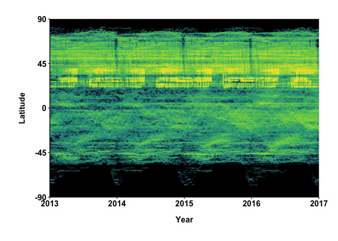

Tracking the Global Footprint of Fisheries: Figure 2
================

This code replicates Figure 2, Panels A and B from the paper Tracking the Global Footprint of Fisheries using the publicly available Big Query tables provided by Global Fishing Watch.

``` r
library(tidyverse)
library(sf)
library(bigrquery)
library(lubridate)
library(fuzzyjoin)
```

#### Figure Prep

``` r
theme_gfw_paper <-  theme(text = element_text(family="Arial", face="bold", size=10),
        axis.text.x = element_text(size = 12, colour = "black"),
        axis.text.y = element_text(size = 12, colour = "black"),
        axis.line.x = element_line(colour = "black", size = .5),
        axis.line.y = element_line(colour = "black", size = .5),
        legend.position = "bottom",
        axis.title.y = element_text(size = 12, margin=margin(0,15,0,0)),
        axis.title.x = element_text(size = 12, margin=margin(15,0,0,0)),
        panel.grid.major = element_blank(), 
        panel.grid.minor = element_blank(),
        panel.background = element_blank(), 
        axis.line = element_line(colour = "black"),
        plot.margin = unit(c(1,1,1,1), "cm")
        )
```

### Panel A: Global Patterns Panel

Query to generate the total fishing hours group by latitude, day and year. The original plot provided finer resolution of grouping by 12 hours (0.5 day), but a similar plot is possible using day aggregated data.

``` sql
  SELECT
  SUM(fishing_hours) total_fishing_hours,
  FLOOR((lat_bin/100)*4)/4 lat_bin,
  integer(DAYOFYEAR(date)) day,
  integer(YEAR(date)) year,
  FROM
    [global-fishing-watch:global_footprint_of_fisheries.fishing_effort]
  WHERE
    _PARTITIONTIME >= "2013-01-01 00:00:00"
    AND _PARTITIONTIME < "2017-01-01 00:00:00"
    AND fishing_hours > 0
GROUP BY
  lat_bin,
  day,
  year
```

``` r
head(global_fish_patterns)
```

    FALSE   total_fishing_hours lat_bin day year
    FALSE 1           34.556944  -38.25 313 2013
    FALSE 2           41.818472  -43.25 313 2013
    FALSE 3           25.221111  -38.00 313 2013
    FALSE 4          423.063333   50.00 313 2013
    FALSE 5            8.852639  -44.25 313 2013
    FALSE 6           21.907639  -10.25 313 2013

#### Data Processing

Here we processes the dates and replace a date that is irrecoverably missing (2013-05-31). The values for that date are imputed as the mean fishing hours for the preceeding and following day at each latitude.

``` r
global_fish_patterns$date = format(as.Date(paste(global_fish_patterns$year, 
                                                global_fish_patterns$day, 
                                                sep='-'),"%Y-%j"), "%Y-%m-%d")

#get May 30, 2013 and June 1, 2013 and average to substitute for the missing May 31, 2013
may_31_estimate = global_fish_patterns %>% 
    filter(date == as.Date('2013-05-30') | date == as.Date('2013-06-01')) %>%
    group_by(lat_bin) %>%
    summarize(total_fishing_hours = mean(total_fishing_hours, na.rm = TRUE))
may_31_estimate$day = c(rep(151, nrow(may_31_estimate)))
may_31_estimate$year = c(rep(2013, nrow(may_31_estimate)))
may_31_estimate$date = c(rep('2013-05-31', nrow(may_31_estimate)))
global_fish_patterns = rbind(global_fish_patterns, may_31_estimate)
```

Additional processing for generating appropriate color scale

``` r
global_fish_patterns$maxxed_hours = ifelse(global_fish_patterns$total_fishing_hours >= 1000, 
                                           1000, 
                                           global_fish_patterns$total_fishing_hours) #originally 10000
global_fish_patterns$maxxed_hours = ifelse(global_fish_patterns$total_fishing_hours <=1, 
                                           1, 
                                           global_fish_patterns$total_fishing_hours)
global_fish_patterns$maxxed_hours = ifelse(global_fish_patterns$lat_bin < -85, 
                                           0, 
                                           global_fish_patterns$maxxed_hours) #just to clean up a few odd points
```

### Making Plot

``` r
color_grad = c( "#414487", "#2A788E", "#22A884", "#7AD151","#FDE725","#FFC04C")
    back_fill = 'black'
    
global_patterns_plot <- ggplot2::ggplot() +
        ggplot2::geom_raster(data = global_fish_patterns,
                    aes(as.Date(date),lat_bin,
                        fill = log10(maxxed_hours*4)),
                    interpolate = TRUE)+
        ggplot2::scale_fill_gradientn("Fishing Effort     \n",
                             colors = color_grad,
                             na.value = NA,
                             breaks = c(0.60206,1.60206, 2.60206, 3.60206, 4.60206),
                             limits = c(0.60206,4.60206),
                             labels = c('0', '0.4','4','40','>400') #,
                             #guide = 'none'
        ) +
        ggplot2::scale_x_date('Year', date_breaks = 'year', date_labels = '%Y',
                     expand = c(0,0),
                     limits = c(as.Date('2013-01-01'), as.Date('2017-01-01'))) +
        ggplot2::scale_y_continuous('Latitude',
                           limits = c(-90, 90),
                           breaks = c(seq(-90,90, 45)),
                           expand = c(0,0)) +
        theme_gfw_paper +
        theme(text = element_text(family="Arial", face="bold", size=10),
              axis.text.x = element_text(size = 12, colour = "black"),
              axis.text.y = element_text(size = 12, colour = "black"),
              axis.line.x = element_line(colour = "black", size = .5),
              axis.line.y = element_line(colour = "black", size = .5),
              axis.title.y = element_text(size = 12, margin=margin(0,15,0,0)),
              axis.title.x = element_text(size = 12, margin=margin(15,0,0,0)),
              panel.grid.major = element_blank(),
              panel.grid.minor = element_blank(),
              axis.line = element_line(colour = "black"),
              # legend.position = 'bottom',
              # legend.direction = 'horizontal',
              # legend.key.height = unit(.2, 'cm'),
              # legend.key.width = unit(1,'cm'),
              # legend.title.align = 0,
              legend.position = 'none',
              panel.background = element_rect(fill = back_fill ),
              plot.margin = unit(c(1, 1,1,1), 'cm'))
global_patterns_plot
```



##### Making Legend

Generating a separate legend for the plot for flexibility and convenience.

``` r
library(cowplot)
global_patterns_legend <- ggplot2::ggplot() +
        ggplot2::geom_raster(data = global_fish_patterns,
                    aes(as.Date(date),lat_bin,
                        fill = log10(maxxed_hours*4)),
                    interpolate = TRUE)+
        ggplot2::scale_fill_gradientn("Fishing Effort     \n",
                             colors = color_grad,
                             na.value = NA,
                             breaks = c(0.60206,1.60206, 2.60206, 3.60206, 4.60206),
                             limits = c(0.60206,4.60206),
                             labels = c('0', '0.4','4','40','>400') #,
                             #guide = 'none'
        ) +
        theme_gfw_paper +
        theme(legend.position = 'bottom',
              legend.direction = 'horizontal',
              legend.key.height = unit(.2, 'cm'),
              legend.key.width = unit(1,'cm'),
              legend.title.align = 0,
              panel.background = element_rect(fill = back_fill ),
              plot.margin = unit(c(1, 1,1,1), 'cm'))

global_legend <- get_legend(global_patterns_legend)
```

### Panel C: Fishing Hours Chinese Vessels

The following code is not identical to that used to generate the original Panel C, of Figure 2, but demonstrates how, with a bit of wrangling, a similar figure can be generated using publically available data.

#### Query Date

Query to identify fishing hours by Chinese vessels, grouped by date and year, NEAR the Chinese EEZ. This will be restricted to just be that fishing which takes place within the Chinese EEZ later.

``` sql
SELECT
  YEAR(date) year,
  date,
  FLOOR((lat_bin/100)*10) / 10 AS lat_bin,
  FLOOR((lon_bin/100)*10) / 10 AS lon_bin, 
  SUM(fishing_hours) fishing_hours
FROM
[global-fishing-watch:global_footprint_of_fisheries.fishing_effort] 
  WHERE
    _PARTITIONTIME >= "2013-01-01 00:00:00"
    AND _PARTITIONTIME < "2017-01-01 00:00:00"
  AND flag == "CHN"
  AND lat_bin/100 < 47
  AND lon_bin/100 > 101
  AND lat_bin/100 > 12
  AND lon_bin/100 < 136
  AND fishing_hours > 0
GROUP BY
  date,
  lat_bin,
  lon_bin, 
  year
```

#### Identify Fishing Hours within Chinese EEZ

``` r
#read in EEZ shapefile available from Marine Regions http://www.marineregions.org/downloads.php
eez_sp <- sf::read_sf('~/shapefiles/World_EEZ_v10.shp')

#reduce the shapefile to just the Chinese EEZ
eez_chn_sp <- eez_sp %>%
    filter(ISO_3digit == 'CHN')

#convert dataframe of gridded values to sf class
chn_sf = sf::st_as_sf(chinese_active_vessels_all_years, 
                      coords = c('lon_bin', 'lat_bin'), crs = 4326, agr = "constant")

#spatial left join, functions as a point in polygon to identify those fishing hours
#that take place within the Chinese EEZ.
event_in_shp <- sf::st_join(chn_sf, eez_sp, join = sf::st_intersects, left = TRUE)
chinese_active_vessels_inside_eez <- event_in_shp %>%
    dplyr::filter(!is.na(ISO_3digit)) %>%
    dplyr::select(year, date, fishing_hours)
chinese_active_vessels_inside_eez <- as.data.frame(chinese_active_vessels_inside_eez)
```

### Further Processing for Chinese Moratoria and New Year

``` r
chinese_active_vessels_inside_eez <- chinese_active_vessels_inside_eez %>% 
  mutate(date = lubridate::ymd(date)) %>% 
  group_by(year, date) %>% 
  summarise(fishing_hours = sum(fishing_hours)) %>% 
  ungroup() %>% 
  dplyr::select(-year)


moratoria_dates1 <- tibble(year = c(2013:2016)) %>% 
  mutate(start_date = lubridate::ymd(paste(year,"-06-01",sep = "")),
         end_date = lubridate::ymd(paste(year,"-08-01",sep = "")))
moratoria_dates2 <- tibble(year = c(2013:2016)) %>% 
  mutate(start_date = lubridate::ymd(paste(year,"-05-16",sep = "")),
         end_date = lubridate::ymd(paste(year,"-09-16",sep = "")))

new_year_dates <- tibble(year = c(2013:2016),
                         start_date = c(lubridate::ymd("2013-02-07"),
                                        lubridate::ymd("2014-01-28"),
                                        lubridate::ymd("2015-02-16"),
                                        lubridate::ymd("2016-02-05")),
                         end_date = c(lubridate::ymd("2013-02-07") + days(23),
                                        lubridate::ymd("2014-01-28") + days(23),
                                        lubridate::ymd("2015-02-16") + days(23),
                                        lubridate::ymd("2016-02-05") + days(23)))

chinese_active_vessels_inside_eez <- chinese_active_vessels_inside_eez %>% 
  fuzzyjoin::fuzzy_left_join(new_year_dates, 
                             by = c("date" = "start_date", "date" = "end_date"), 
                             match_fun = list(`>=`, `<=`)) %>% 
  mutate(new_year = ifelse(!is.na(year), TRUE, FALSE)) %>% 
  dplyr::select(-start_date, -end_date,  -year ) %>% 
  distinct() %>% 
  fuzzyjoin::fuzzy_left_join(moratoria_dates1, 
                by = c("date" = "start_date", "date" = "end_date"), 
                match_fun = list(`>=`, `<=`)) %>% 
  mutate(moratoria1 = ifelse(!is.na(year), TRUE, FALSE)) %>% 
  dplyr::select(-start_date, -end_date,  -year ) %>% 
  distinct() %>% 
  fuzzyjoin::fuzzy_left_join(moratoria_dates2, 
                by = c("date" = "start_date", "date" = "end_date"), 
                match_fun = list(`>=`, `<=`)) %>% 
  mutate(moratoria2 = ifelse(!is.na(year), TRUE, FALSE)) %>% 
  dplyr::select(-start_date, -end_date,  -year ) %>% 
  distinct() 

new_year_rows <- which(chinese_active_vessels_inside_eez$new_year == T)

new_year_counterfactual_rows <- unique(sort(new_year_rows + rep(-5:5, each = length(new_year_rows)))) 

new_year_counterfactual_rows <- new_year_counterfactual_rows[!new_year_counterfactual_rows %in% new_year_rows]

chinese_active_vessels_inside_eez <- chinese_active_vessels_inside_eez %>% 
  mutate(new_year_counterfactual = ifelse(row_number() %in% new_year_counterfactual_rows, T, F))

theme_gfw_paper <-  theme(text = element_text(family="Arial", face="bold", size=14),
        axis.text.x = element_text(size = 12, colour = "black"),
        axis.text.y = element_text(size = 12, colour = "black"),
        axis.line.x = element_line(colour = "black", size = .5),
        axis.line.y = element_line(colour = "black", size = .5),
        legend.position = "right",
        axis.title.y = element_text(margin=margin(0,15,0,0)),
        axis.title.x = element_text(margin=margin(15,0,0,0)),
        panel.grid.major = element_blank(), 
        panel.grid.minor = element_blank(),
        panel.background = element_blank(), 
        axis.line = element_line(colour = "black")
        )
```

#### Making Panel C

``` r
chinese_moratoria_plot_fishing_hours <- ggplot() +
  geom_rect(data = moratoria_dates1, 
            aes(xmin = start_date, 
                xmax = end_date,
                ymin = 0,
                ymax = Inf,
                fill = "tomato"),
            alpha = 0.5, 
            show.legend = TRUE) +
    geom_rect(data = moratoria_dates2, 
            aes(xmin = start_date, 
                xmax = end_date,
                ymin = 0,
                ymax = Inf,
                fill = "tomato"),
            alpha = 0.15, 
            show.legend = TRUE) +
  geom_rect(data = new_year_dates, 
            aes(xmin = start_date, 
                xmax = end_date,
                ymin = 0,
                ymax = Inf,
                fill = "#f7e456"),
            alpha = 1,
            show.legend = TRUE) +
  geom_line(data = chinese_active_vessels_inside_eez,
           aes(x = date, y = fishing_hours/1000), 
           size = 0.3) +
  theme_minimal() +
  scale_x_date(date_breaks = "1 year", 
               date_labels = "%Y ", 
               limits = c(as.Date("2013-01-01"), as.Date('2017-01-01')),
               expand = c(0,0)) +
  xlab("") +
  scale_y_continuous(breaks = c(0,20,40,60),
                     expand = c(0, 0), 
                     labels = scales::comma, 
                     limits = c(0,60) ) +
  ylab("Fishing Hours (x1000)")+
  scale_fill_manual(values = c("#f7d694", "tomato"),
                    name = " ",
                    labels = c("Chinese New Year", "Moratoria")) +
  theme_gfw_paper +
     theme(axis.ticks = element_line(size = 0.5),
        panel.grid.major = element_blank(), 
        panel.grid.minor = element_blank(),
        panel.background = element_blank(), 
        axis.line = element_line(colour = "black"),
        axis.text.y = element_text(size = 10),

        legend.justification = "top",
        legend.position = 'none',
        legend.text = element_text(size = 6),
        plot.margin = unit(margin(1,1,1,1),'cm')
        )
chinese_moratoria_plot_fishing_hours
```


