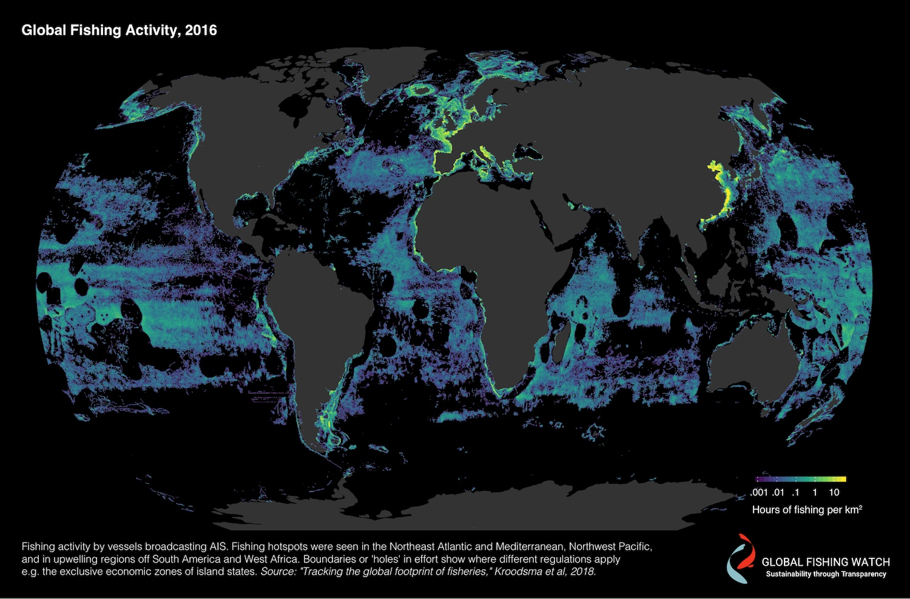

# Tracking the Global Footprint of Fisheries

This repo contains code, analyses, and links to data for [Kroodsma, D.A., J. Mayorga, T. Hochberg, N.A. Miller, K. Boerder, F. Ferretti, A. Wilson, 7 B. Bergman, T.D. White, B.A. Block, P. Woods,B. Sullivan, C. Costello, B. Worm. "Tracking the Global Footprint of Fisheries." _Science_ Vol 361 Issue 6378.](http://science.sciencemag.org/cgi/doi/10.1126/science.aao1118)

To get the fishing effort and vessel data associated with this paper, [visit Global Fishing Watch's community page](https://globalfishingwatch.force.com/gfw/s/data_download).

To see blog postings about the paper and the related dataset, visit [Global Fishing Watch's Research and Development site](http://globalfishingwatch.io/global-footprint-of-fisheries.html).

This site currently contains only a subset of the analyses from the paper. We will be adding to this repo over the next months. To get updates, join the [Global Fishing Watch Research Accelerator Program](https://globalfishingwatch.force.com/gfw/s/).

