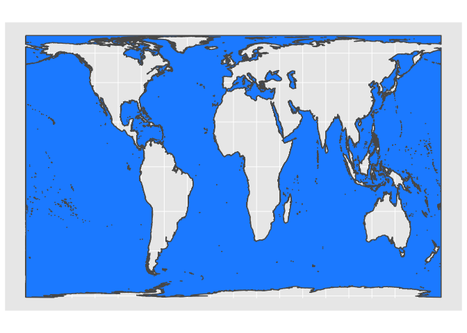
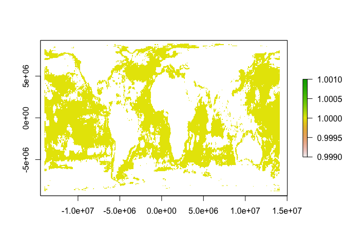
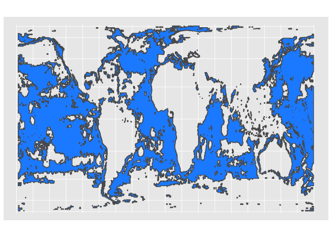

Area of the Ocean that is Fished
================

``` r
library(bigrquery)
library(dplyr)
library(raster)
library(sp)
library(rgdal)
library(sf)
library(rgeos)
library(ggplot2)
```

``` sql
SELECT
  SUM(fishing_hours)/(COS(RADIANS(lat_bin/2)) * POW(111, 2)) hours_sq_km,
  lat_bin,
  lon_bin
FROM (
  SELECT
    FLOOR((lat_bin/100)/0.5) * 0.5  lat_bin,
    FLOOR((lon_bin/100)/0.5) * 0.5  lon_bin,
    fishing_hours
  FROM
    [global-fishing-watch:global_footprint_of_fisheries.fishing_effort]
  WHERE
    _PARTITIONTIME >= "2016-01-01 00:00:00"
    AND _PARTITIONTIME < "2017-01-01 00:00:00"
    AND fishing_hours > 0)
GROUP BY
  lat_bin,
  lon_bin
```

Generate a grid of points at 0.5

``` r
grid_latlon <- expand.grid(lat =seq(min(total_fishing_effort_05$lat_bin),
                                    max(total_fishing_effort_05$lat_bin), 0.5), 
                           lon = seq(min(total_fishing_effort_05$lon_bin),
                                     max(total_fishing_effort_05$lon_bin), 0.5))
```

Join the global grid to the global fishing data. Assign locations with no fishing a fishing value of 0.

``` r
gridded_fishing = left_join(grid_latlon, total_fishing_effort_05, by = c('lat' = 'lat_bin', 'lon' = 'lon_bin'))
gridded_fishing$hours = ifelse(is.na(gridded_fishing$hours), 0, gridded_fishing$hours)
```

Convert fishing effort dataframe into a spatial dataframe (specify lon and lat as x, y)

``` r
coordinates(gridded_fishing)=~lon+lat
```

Assign a projection to the gridded fishing effort

``` r
# set it to lat-long
proj4string(gridded_fishing)=CRS("+proj=longlat +ellps=WGS84 +datum=WGS84 +no_defs") 

#ensure fishing in on regular grid
gridded(gridded_fishing) = TRUE
```

Generate the fishing effort raster. Specify original projection and extent, then project the raster into Gall-Peters equal area

``` r
fishing_raster_05 = rasterFromXYZ(gridded_fishing, crs = "+proj=longlat +ellps=WGS84 +datum=WGS84 +no_defs")
bb = extent(-180.25, 179.75, -88.25, 81.75)
fishing_raster_05 = setExtent(fishing_raster_05, bb, keepres = TRUE)
#this is Gall-Peters Equal Area Projection
fishing_raster_05 = projectRaster(fishing_raster_05, crs = "+proj=cea +lon_0=0 +x_0=0 +y_0=0 +lat_ts=45 +datum=WGS84 +units=m +no_defs", over = TRUE) 
```

Export raster

``` r
writeRaster(fishing_raster_05, '~/Documents/GlobalFishingWatch/Global_raster_paper/oceans_equal_area/fishing_raster_05_20180228.tif', format = 'GTiff', overwrite = TRUE)
```

Either read in fishing raster of continue from above. Load an oceans shapefile

``` r
#fishing_raster_05 <- raster('~/Documents/GlobalFishingWatch/Projects/Global_raster_paper/oceans_equal_area/fishing_raster_05.tif')
ocean_cea_sf <- read_sf('~/Documents/GlobalFishingWatch/shapefiles/oceans_CEA_equal_area/oceans_cea.shp')
```

Reproject the oceans shapefile using a Gall-Peters Equal Area Projection to ensure equal area at all latitudes.

``` r
ocean_cea_sf <- st_transform(ocean_cea_sf, crs = "+proj=cea +lon_0=0 +lat_ts=45 +x_0=0 +y_0=0 +datum=WGS84 +units=m +no_defs")
```

Check the vector file and projection look appropriate

``` r
head(ocean_cea_sf)
```

    FALSE Simple feature collection with 1 feature and 19 fields
    FALSE geometry type:  MULTIPOLYGON
    FALSE dimension:      XY
    FALSE bbox:           xmin: -14192430 ymin: -8953315 xmax: 14192430 ymax: 8984818
    FALSE epsg (SRID):    NA
    FALSE proj4string:    +proj=cea +lon_0=0 +lat_ts=45 +x_0=0 +y_0=0 +datum=WGS84 +units=m +no_defs
    FALSE # A tibble: 1 x 20
    FALSE   featurecla scalerank fishingcou fishingmea not_fishin meanmean
    FALSE   <chr>          <int>      <dbl>      <dbl>      <dbl>    <dbl>
    FALSE 1 Ocean              0  0.0000141       1.00      0.454   0.0733
    FALSE # ... with 14 more variables: overlapmea <dbl>, pos20_mean <dbl>,
    FALSE #   nofish_mea <dbl>, test_mean <dbl>, X0725_mean <dbl>,
    FALSE #   X0725_20_me <dbl>, nonfish_me <dbl>, X0728mean_m <dbl>,
    FALSE #   nofish_und <dbl>, nofish_05m <dbl>, high_seasm <dbl>,
    FALSE #   highseas_m <dbl>, highseas_1 <dbl>, geometry <simple_feature>

``` r
ggplot() +
    geom_sf(data = ocean_cea_sf, fill = 'dodgerblue')
```



For simplicity areas of fishing a value of 1 and those without NA.

``` r
fishing_raster_05[fishing_raster_05[] > 0] <- 1 
fishing_raster_05[fishing_raster_05[] <= 0] <- NA 
```

A quick visual check to see if the raster looks appropriate (though it will not yet have the appropriate projection)

``` r
plot(fishing_raster_05)
```



Convert the raster to a vector which makes it possible to compare with the oceans vector.

``` r
#raster to polygon using maximum number of vertices (n = 16)
fishing_polygon <- rasterToPolygons(fishing_raster_05, dissolve = TRUE, n = 16)
#convert Spatial dataframe to Simple features
fishing_polygon_sf <- st_as_sf(fishing_polygon)
#reproject fishing to Gall-Peters Equal area projection
fishing_polygon_sf <- st_transform(fishing_polygon_sf, crs = "+proj=cea +lon_0=0 +lat_ts=45 +x_0=0 +y_0=0 +datum=WGS84 +units=m +no_defs")
```

Identify where the fishing and ocean vector files intersect. Ensures we clip the fishing raster to the ocean.

``` r
fishing_ocean_intersect <- sf::st_intersection(x = ocean_cea_sf, fishing_polygon_sf)
```

Calculate the area of the fishing/ocean intersection vector and the area of the ocean vector, both of which are in equal area projection. The units are relatively unimportant, but in m<sup>2</sup>. Calculate the percent of the ocean that is covered fishing.

``` r
fishing_area <- st_area(fishing_ocean_intersect)
ocean_area <- st_area(ocean_cea_sf)
(fishing_area/ocean_area) * 100
```

    Percent of ocean fished: 50.55793 

``` r
library(ggplot2)
ggplot() +
    geom_sf(data = fishing_polygon_sf, fill = 'dodgerblue')
```



#### Same analysis using previous fishing raster

``` r
fishing_raster_05_old <- raster('~/Documents/GlobalFishingWatch/Projects/Global_raster_paper/oceans_equal_area/fishing_raster_05.tif')
```

For simplicity areas of fishing a value of 1 and those without NA.

``` r
fishing_raster_05_old[fishing_raster_05_old[] > 0] <- 1 
fishing_raster_05_old[fishing_raster_05_old[] <= 0] <- NA 
```

A quick visual check to see if the raster looks appropriate (though it will not yet have the appropriate projection)

``` r
plot(fishing_raster_05_old)
```


Convert the raster to a vector which makes it possible to compare with the oceans vector.

``` r
#raster to polygon using maximum number of vertices (n = 16)
fishing_polygon_old <- rasterToPolygons(fishing_raster_05_old, dissolve = TRUE, n = 16)
#convert Spatial dataframe to Simple features
fishing_polygon_old_sf <- st_as_sf(fishing_polygon_old)
#reproject fishing to Gall-Peters Equal area projection
fishing_polygon_old_sf <- st_transform(fishing_polygon_old_sf, crs = "+proj=cea +lon_0=0 +lat_ts=45 +x_0=0 +y_0=0 +datum=WGS84 +units=m +no_defs")
```

Identify where the fishing and ocean vector files intersect. Ensures we clip the fishing raster to the ocean.

``` r
fishing_old_ocean_intersect <- sf::st_intersection(x = ocean_cea_sf, fishing_polygon_old_sf)
```

Calculate the area of the fishing/ocean intersection vector and the area of the ocean vector, both of which are in equal area projection. The units are relatively unimportant, but in m<sup>2</sup>. Calculate the percent of the ocean that is covered fishing.

``` r
fishing_area_old <- st_area(fishing_old_ocean_intersect)
ocean_area <- st_area(ocean_cea_sf)
(fishing_area_old/ocean_area) * 100
```

    Percent of ocean fished: 54.4856 
