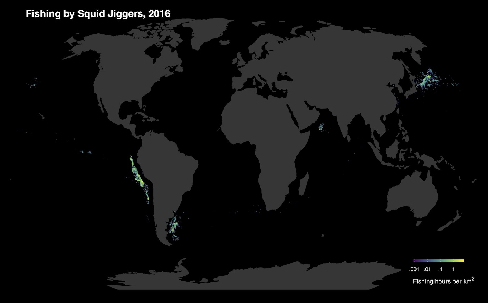

# Updated Algorithm for Squid Jiggers

Between paper acceptance and publication of our paper, we changed how our dataset calculates fishing activity for squid jiggers, and this change is reflected in the dataset we have released. 

Squid jiggers make up a small fraction of the vessels in our database, and about 600 out of 70,000 mmsi are likely squid jiggers. Our fishing effort training data included all our other major geartypes, but did not include squid jiggers. As a result, the neural net model did a poor job at identifying when these vessles were fishing, and falsely labeled many of the transits of these vessels as fishing activty.

Based on conversations with experts, and a review of the activity of the squid fleet operating outside the Peruvian EEZ, we've discovered that squid vessels fish only at night, and only while not moving. Rather than retrain the neural net model, we applied this hueristic to all squid vessels -- we count fishing activity as only the activity when they are standing still for for several hours at night. We tried a  different cutoffs for speed and the number of hours the vessels had to remain still, and decided on a rule that counts anything as fishing if the vessel is > 10 nautical miles from shore and moving slower than 1.5 knots at night for more than four hours. We plan to eventually provide training data for our model to better identify likely fishing activity by Squid Jiggers.			

